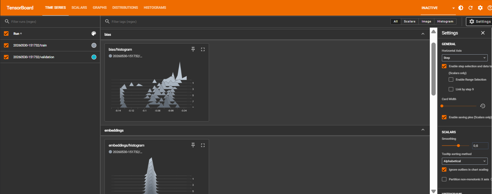
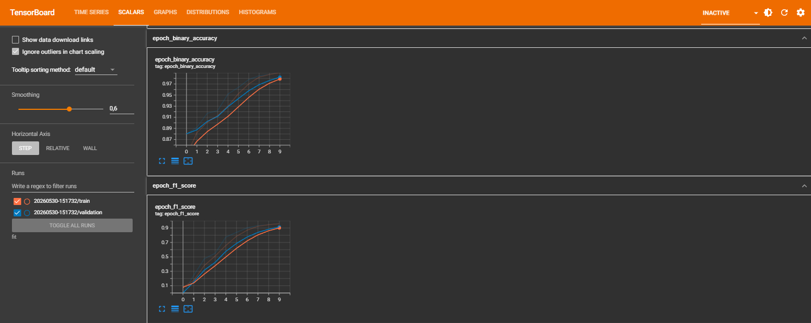

# ADUIN AI - Multi-Label Complaint Classification


## 📌 Deskripsi Proyek

**ADUIN (Analisis Digital Untuk Insight Nusantara)** adalah platform analitik pengaduan masyarakat berbasis AI yang membantu pemerintah daerah mengidentifikasi, mengelompokkan, dan memprioritaskan keluhan warga dari berbagai kanal digital.

Model NLP yang dikembangkan mampu:

* 🏷️ Mengklasifikasikan keluhan ke dalam 10 kategori pengaduan
* ⚡ Mengukur tingkat urgensi laporan
* 🔗 Mengelompokkan laporan dengan isu serupa
* 📊 Menyediakan insight untuk dashboard monitoring pemerintah

Dengan pendekatan ini, laporan penting seperti banjir, longsor, atau kerusakan infrastruktur dapat terdeteksi dan diprioritaskan lebih cepat.


## 🏷️ Kategori Keluhan

Model melakukan klasifikasi multi-label terhadap 10 kategori pengaduan:

1. Infrastruktur
2. Lingkungan
3. Air dan Sanitasi
4. Bencana
5. Transportasi
6. Pelayanan Publik
7. Keamanan
8. Sosial
9. Kesehatan
10. Pendidikan

Karena menggunakan pendekatan **multi-label classification**, satu laporan dapat memiliki lebih dari satu kategori sekaligus.

Contoh:

> "Jalan rusak menyebabkan banjir karena drainase tersumbat."

Dapat diklasifikasikan sebagai:

* Infrastruktur
* Air dan Sanitasi
* Bencana

---

## 🧠 Arsitektur Model

Model dibangun menggunakan **TensorFlow Functional API** dengan arsitektur berikut:

```text
Input Text
    │
    ▼
Embedding (128)
    │
    ▼
SpatialDropout1D
    │
    ▼
Bidirectional LSTM (64)
    │
    ▼
GlobalMaxPooling1D
    │
    ▼
Dense (128, ReLU)
    │
    ▼
Dropout (0.3)
    │
    ▼
Dense (64, ReLU)
    │
    ▼
Output Layer (10 Sigmoid)
```

Arsitektur ini dirancang untuk menangkap konteks kalimat berbahasa Indonesia sekaligus mendukung tugas **multi-label classification** pada 10 kategori pengaduan.


---

## ⚙️ Komponen Kustom

Proyek ini mengimplementasikan komponen kustom lanjutan sesuai ketentuan tugas.

### Custom Metric: F1 Score

Model menggunakan implementasi custom metric F1-Score yang dibangun menggunakan:

* Precision
* Recall

Tujuan penggunaan F1-Score adalah karena dataset multi-label lebih representatif dievaluasi menggunakan keseimbangan antara precision dan recall dibandingkan accuracy saja.

### Custom Callback: StopIfGood

Dibangun callback khusus yang akan:

* Memantau F1-Score validation setiap epoch.
* Menghentikan pelatihan apabila:

  * F1 Score ≥ 90%
  * Tidak ada peningkatan F1 dalam beberapa epoch (patience).
---

## 📊 Monitoring dengan TensorBoard

Selama proses training, seluruh metrik dicatat menggunakan TensorBoard.

Log yang direkam meliputi:

* Loss
* Validation Loss
* Accuracy
* Precision
* Recall
* F1 Score
* Histogram parameter model
* Struktur graph model

File log telah disediakan dalam:

```text
tensorboard_logs.zip
```

---

## 🚀 Menjalankan TensorBoard

### 1. Extract file log

```bash
unzip tensorboard_logs.zip
```

atau ekstrak secara manual.

---

### 2. Install TensorBoard

```bash
pip install tensorboard
```

---

### 3. Jalankan TensorBoard

```bash
tensorboard --logdir logs
```

---

### 4. Buka browser

```text
http://localhost:6006
```

---

## 📸 Hasil Visualisasi TensorBoard

### Training Trends (Time Series)

TensorBoard digunakan untuk memvisualisasikan perkembangan metrik pelatihan dari setiap epoch, sehingga memudahkan proses monitoring performa model.



---

### Training Metrics (Scalars)

TensorBoard digunakan untuk memantau perkembangan metrik selama proses pelatihan, termasuk loss, accuracy, precision, recall, F1-Score, dan AUC.



---


## 📂 Struktur Repository

```text
├── deep_learning_model.ipynb
├── model_multilabel.keras
├── saved_model.zip
├── tensorboard_logs.zip
├── tokenizer.pkl
├── README.md
└── requirements.txt
```

---

## 💾 Model Export

Model disimpan dalam dua format:

### Keras Format

```text
model_multilabel.keras
```

Digunakan untuk deployment TensorFlow/Keras.

### TensorFlow SavedModel

```text
saved_model/
```

---

## 🔗 Integrasi API

Model ini telah diintegrasikan ke dalam REST API terpisah.

Repository API:

[https://github.com/syukronJazila/keluhan-multilabel-classification-api](https://github.com/syukronJazila/keluhan-multilabel-classification-api)

---

## 🛠️ Teknologi yang Digunakan

* Python
* TensorFlow
* Keras
* NumPy
* Pandas
* Scikit-Learn
* TensorBoard
* Matplotlib

---

## 📈 Hasil Evaluasi Model

### Initial Evaluation

| Dataset    | Accuracy | Precision | Recall | F1-Score | AUC    |
| ---------- | -------- | --------- | ------ | -------- | ------ |
| Train      | 99.75%   | 99.86%    | 98.06% | 98.95%   | 99.99% |
| Validation | 99.12%   | 98.57%    | 93.99% | 96.22%   | 99.48% |
| Test       | 98.89%   | 97.76%    | 93.07% | 95.36%   | 99.28% |

### Evaluation Data Test Setelah Threshold Tuning

| Metric      | Score |
| ----------- | ----- |
| Micro F1    | 96%   |
| Macro F1    | 95%   |
| Weighted F1 | 96%   |
| Sample F1   | 96%   |
| Precision   | 97%   |
| Recall      | 95%   |

### Kesimpulan

- Akurasi model mencapai **98.89%** pada data testing
- F1-Score testing mencapai **95.36%**
- Melampaui persyaratan minimum **akurasi ≥ 85%**
- Model menunjukkan generalisasi yang baik pada data validasi dan testing


---

# 👨‍💻 Author

Muhammad Syukron Jazila

---

# 📄 License

Licensed under [MIT License](https://github.com/syukronJazila/parkour-ruokrap/blob/main/LICENSE)

Silakan digunakan, dipelajari, dimodifikasi, dan dikembangkan kembali dengan tetap mencantumkan atribusi kepada pembuat proyek.
